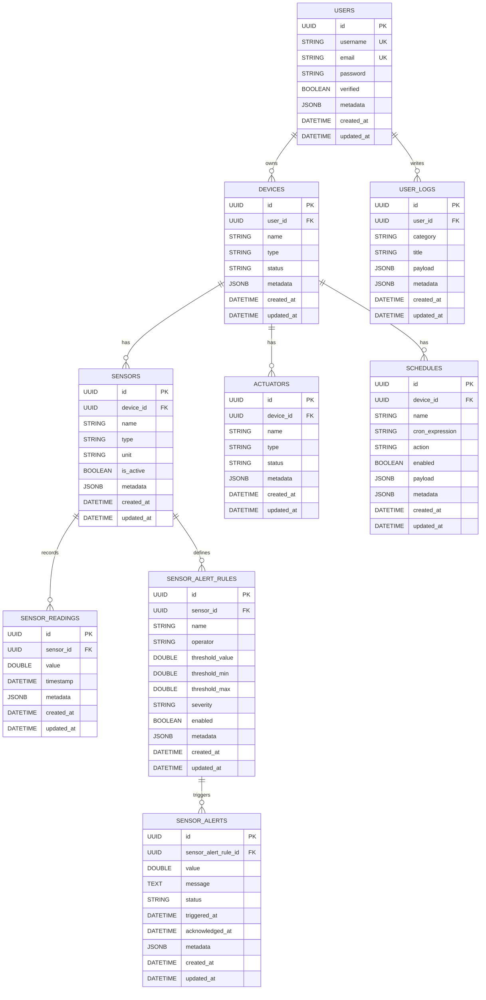

# Database ERD and Stored Data

This project uses two data stores:

- **PostgreSQL** for relational, persistent domain data.
- **Redis** for cache and short-lived operational data.

Last reviewed against entity definitions in `backend/entity/*.js`: 2026-04-28.

## What is saved in PostgreSQL

The backend Sequelize entities persist these tables:

- `users`
- `devices`
- `sensors`
- `sensor_readings`
- `actuators`
- `schedules`
- `sensor_alert_rules`
- `sensor_alerts`
- `user_logs`

## PostgreSQL ERD (Mermaid)

## What is saved in Redis

Redis is used as non-relational cache/storage (not part of ERD):

- Command cache: `cmd:{sessionId}:{command}:{currentPath}:{parameters}`
- Fog aggregates: `fog:agg:{sensorType}:{location}:{timeframe}`
- Fog anomalies: `fog:anomaly:{anomaly_id}`
- Recent anomalies list: `fog:anomalies:recent`
- Fog devices: `fog:device:{device_id}`

Most Redis keys are TTL-based and can expire automatically.
